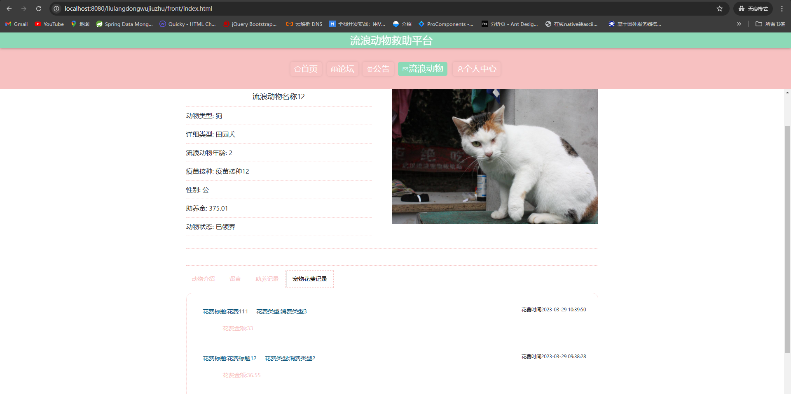

# 一、系统说明

基于springboot+vue+elementui开发的流浪动物救助平台,系统功能齐全, 代码简洁易懂，适合小白学编程。

# 二、系统架构

######      前端：vue| elementui

######      后端：springboot | mybatis 

######      环境：jdk1.8+ | mysql8.0+ | maven

# 三、代码及数据库

# 四、相关功能介绍

#### 1).客户端

###### 1.登录

###### 2.用户注册

###### 3.首页

###### 4.论坛

###### 5.公告

###### 6.流浪动物

###### 7.个人中心

######

###### 8.个人中心->收货地址

###### 9.个人中心->流浪动物收藏

###### 10.个人中心->流浪动物近况

###### 11.个人中心->流浪动物领养

###### 12.个人中心->流浪动物助养

#### 2).管理端

###### 1.登录

###### 2.个人中心->修改密码

###### 3.管理员管理

包含:删除、修改、新增、详情功能

###### 4.基础类型管理

包含:帖子类型管理、公告类型管理、动物类型管理、消费类型管理、流浪动物状态管理

###### 5.论坛管理

包含:删贴、修改、新增、查看论坛回复功能

###### 6.论坛管理

包含:删除、详情、新增、修改功能

###### 7.流浪动物管理

包含:删除、详情、新增、修改功能

###### 8.流浪动物管理->流浪动物留言管理

包含:删除、详情、回复、修改功能

###### 9.流浪动物管理->流浪动物收藏管理

包含:删除、详情功能

###### 10.流浪动物管理->流浪动物领养管理

包含:详情、删除、审核功能

###### 11.流浪动物花费管理

包含:修改、详情、删除、新增功能

###### 12.流浪动物近况管理

包含:修改、详情、删除、新增功能

###### 13.流浪动物助养管理

包含:修改、详情、删除、新增功能

###### 14.用户管理

包含:修改、详情、删除、新增、重置密码功能

###### 15.轮播图管理

包含:修改、详情、删除、新增功能

